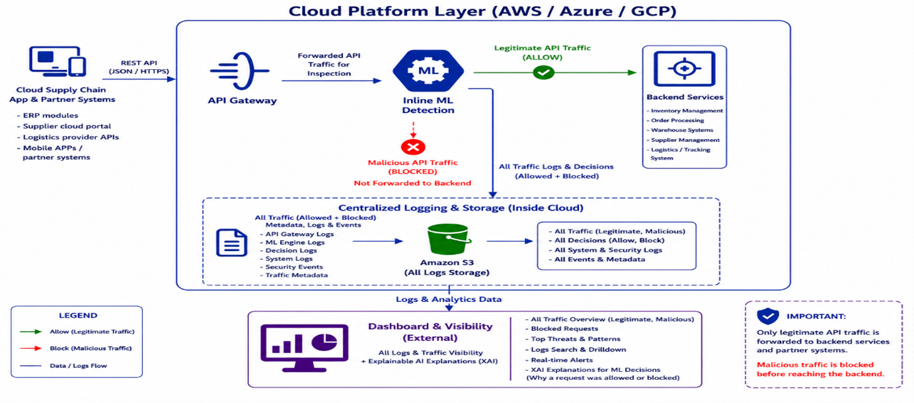
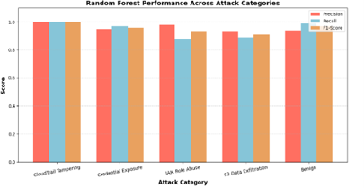
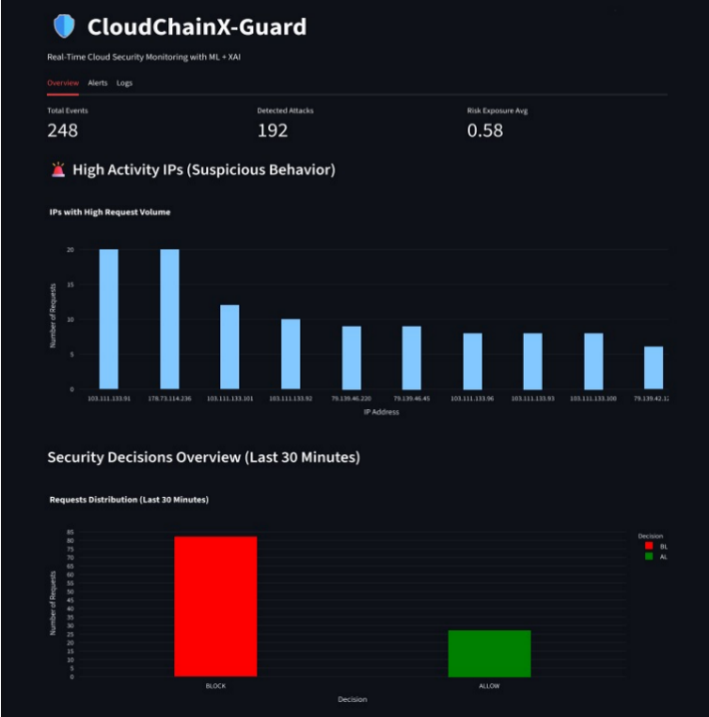
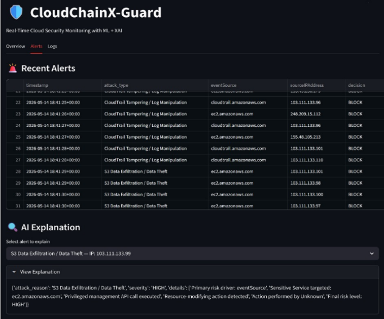
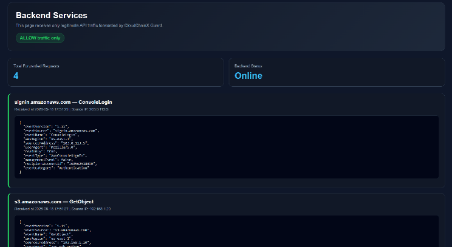

# CloudChainX Guard

ML-Powered Detection and Blocking of Cloud Supply Chain API Attacks

CloudChainX Guard is a machine learning-powered cloud security solution designed to detect and prevent API-level attacks in cloud supply chain environments.

The system performs real-time monitoring and analysis of API traffic, identifies malicious activities, and blocks attacks before they reach backend services. To improve transparency and analyst trust, the solution integrates Explainable AI (XAI) using SHAP to provide interpretable security alerts and attack explanations.

---

## Project Highlights

- Real-time API attack detection and blocking
- Cloud supply chain security monitoring
- Explainable AI (XAI) integration
- AWS cloud simulation environment
- Automated threat classification
- Centralized logging and monitoring dashboard

---

## Architecture

The system inspects API requests before they reach backend cloud services.

Workflow:

Cloud Supply Chain Systems
→ API Gateway
→ Machine Learning Detection Engine
→ Allow / Block Decision
→ Backend Services

All requests and security decisions are logged and visualized through a monitoring dashboard.

---

## Supported Attack Categories

- IAM Role Abuse
- Credential Exposure & Secret Theft
- S3 Data Exfiltration
- CloudTrail Tampering

---

## Technologies Used

- AWS
- Python
- Random Forest
- SHAP
- Flask
- Docker
- LocalStack
- CloudGoat
- Scikit-learn

---

## Machine Learning Performance

The project evaluated multiple machine learning models for cloud attack detection.

| Model | Accuracy |
|---------|---------|
| Random Forest | 95.7% |
| XGBoost | 92.45% |

Random Forest was selected as the final deployment model due to superior performance across all evaluation metrics.

### Model Performance

---

## Security Monitoring Dashboard

### Dashboard Overview

The dashboard provides:

- Threat visibility
- Attack analytics
- Suspicious IP monitoring
- Detection statistics
- Security decision tracking

---

## Explainable AI (XAI)

CloudChainX Guard integrates SHAP-based Explainable AI (XAI) to provide transparent explanations for every detection decision.

This enables analysts to:

- Understand model reasoning
- Investigate incidents faster
- Improve trust in automated detections
- Support security operations workflows

---

## Backend Protection

Only legitimate API traffic is forwarded to backend services.

Malicious requests are automatically blocked before reaching critical cloud resources.

---

## Results

- 96% Attack Detection Accuracy
- Real-Time Threat Detection
- Real-Time Attack Blocking
- Explainable AI Integration
- Cloud Supply Chain Attack Simulation

---

## Team

### Supervisor

Dr. Tahani Gazdar

### Team Members

- Shaden Alsulami
- Shahad Alharbi
- Muruj Algarni
- Sultanh Aldiab
- Dhuha Alsulami

---

## Award

🏆 Best Scientific Poster Award
Innovation & Digital Entrepreneurship Forum 2026

---
## Project Poster

The project poster provides a concise overview of the system architecture, methodology, evaluation process, and key results.

📄 [View Project Poster](‏‏CloudChainX_Guard_Poster.jpeg)
